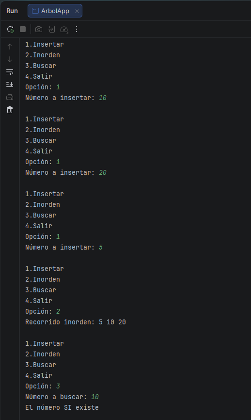
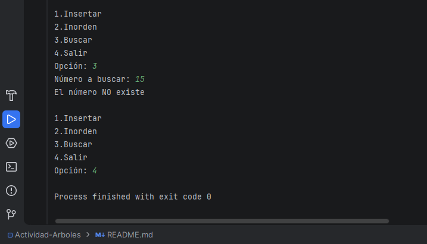

# Actividad Árboles

## ¿Qué es un árbol binario?

Un árbol binario es una estructura de datos que guarda información en forma de "ramas", como un árbol al revés:

- Hay un nodo principal llamado **raíz**.
- Cada nodo puede tener como máximo **dos hijos**:
  - hijo izquierdo
  - hijo derecho

En este proyecto se usa un **Árbol Binario de Búsqueda (BST)**.  
La regla principal es:

- Los valores **menores** van al lado izquierdo.
- Los valores **mayores o iguales** van al lado derecho.

Gracias a esta regla, buscar números es más rápido porque en cada paso se descarta la mitad del camino.

## Cómo se implementó

El archivo tiene tres partes importantes:

### 1) Clase `Nodo`

Representa cada elemento del árbol.

- `int valor`: guarda el número.
- `Nodo izq, der`: apuntan al hijo izquierdo y derecho.
- El constructor recibe el valor y deja los hijos en `null`.

### 2) Clase `ArbolBinario`

Aquí están las operaciones del árbol:

- **`insertar(Nodo nodo, int valor)`**
  - Si el nodo actual es `null`, crea un nodo nuevo.
  - Si el valor es menor, baja por la izquierda.
  - Si es mayor o igual, baja por la derecha.
  - Esto se hace de forma recursiva.

- **`inorden(Nodo nodo)`**
  - Recorre: izquierda -> raíz -> derecha.
  - En un árbol binario de búsqueda, este recorrido imprime los números en orden ascendente.

- **`buscar(Nodo nodo, int valor)`**
  - Si llega a `null`, el valor no existe.
  - Si coincide con el nodo actual, sí existe.
  - Si es menor, busca a la izquierda.
  - Si es mayor, busca a la derecha.

### 3) Clase principal `ArbolApp`

Contiene el método `main` y un menú por consola:

1. **Insertar** un número.
2. Mostrar el recorrido **inorden**.
3. **Buscar** un número.
4. **Salir**.

El programa se repite en un ciclo `do-while` hasta elegir la opción 4.  
En cada inserción se actualiza la raíz con:

`arbol.raiz = arbol.insertar(arbol.raiz, num);`

Así, el árbol va creciendo correctamente desde la raíz.

## Idea clave del programa

Este ejercicio muestra cómo:

- crear nodos,
- organizar datos con la regla de un BST,
- recorrer el árbol para verlos ordenados,
- y buscar valores de forma eficiente.

## Capturas de pantalla

